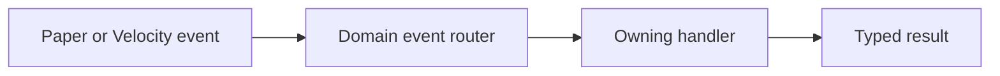

# Project Novus Code Architecture

> **Status:** Active  
> **Applies to:** All Project Novus modules, contributors, automation, and AI-assisted development  
> **Purpose:** Keep the codebase modular, type-safe, testable, and understandable as the game and its platform surface expand.

## 1. Core Principles

Project Novus code must favor clear ownership over convenience.

- Use object-oriented boundaries to keep state and behavior with the system that owns them.
- Apply DRY to shared behavior, not merely similar-looking code. Two flows with different ownership or failure rules may remain separate.
- Prefer explicit, strongly typed models and contracts over raw maps, unbounded objects, stringly typed state, or unchecked casts.
- Introduce abstractions at real boundaries: platform, persistence, runtime state, external integration, or replaceable policy.
- Extend existing systems before creating parallel implementations.
- Keep classes focused on one responsibility and keep cross-system coordination visible.
- Make failure behavior explicit through typed results, neutral returns, recovery paths, or deliberate exceptions.
- Treat existing deviations as migration work, not permission to create more deviations.

Architecture exists to reduce the cost of change. It is not a competitive sport for producing the most interfaces per square inch.

## 2. Module and Package Ownership

Code belongs in the narrowest module and package that owns its behavior.

- Platform-neutral gameplay and durable domain behavior belong in backend or shared API modules.
- Paper-specific world, entity, player, scheduler, and event behavior belongs in the Paper runtime module.
- Velocity-specific routing, login, proxy command, and network enforcement behavior belongs in the proxy module.
- Web and Discord projections belong in their respective modules and must consume shared contracts instead of owning gameplay truth.
- Generic Minecraft framework code must not depend on kingdom-specific runtime code.
- Domain code must not import Paper, Bukkit, or Velocity types unless its module owns that platform boundary.

Package ownership follows the system being operated on, not the class suffix. For example, timer mutation behavior belongs beneath `org.tavall.backend.upgrade.timer`, even when it is used by buildings, breeding, research, and recovery.

## 3. Interfaces

Interfaces use an `I` prefix and live in an `interfaces` child package beneath the narrowest package that owns the contract.

```text
org.tavall.backend.currency
├── interfaces
│   ├── ICurrencyDefinitionRepository.java
│   └── ICurrencyResolver.java
├── PostgresCurrencyDefinitionRepository.java
└── CurrencyResolver.java
```

Rules:

- Concrete implementations remain in the owning parent package unless another role-specific package applies.
- Do not create a global `org.tavall.interfaces` package or a separate interfaces-only module.
- Create an `interfaces` package only when the owning package actually contains interfaces.
- Interface and implementation names should match clearly, such as `ICurrencyResolver` and `CurrencyResolver`.
- Depend on interfaces across replaceable boundaries. Do not add an interface when there is no meaningful contract or substitution point.
- Tests mirror production packages and import the contract from the owning `interfaces` package.

## 4. Handlers and Data Handlers

Handlers live beneath the system they operate on.

```text
org.tavall.backend.upgrade.timer
├── handler
│   ├── interfaces
│   │   └── IGameTimerMutationHandler.java
│   └── GameTimerMutationHandler.java
└── data
    └── handler
        ├── interfaces
        │   └── IGameTimerDataHandler.java
        └── GameTimerDataHandler.java
```

- General behavior handlers use `<system>.handler`.
- Handler interfaces use `<system>.handler.interfaces`.
- DTO, metadata, persistence-routing, and data-mutation handlers use `<system>.data.handler`.
- Data-handler interfaces use `<system>.data.handler.interfaces`.
- Runtime-only state handlers use a clear runtime package such as `<system>.runtime.handler` when the distinction is useful.
- Do not collect unrelated handlers in a module-wide `handler` package.
- Move existing classes into these packages only through a focused migration. Do not bury feature work beneath package churn.

## 5. Class Roles and Naming

Names must describe what a class owns or does.

Preferred roles include:

| Role | Use |
| --- | --- |
| `*Handler` | A focused gameplay or application operation. |
| `*DataHandler` | DTO, metadata, persistence-routing, or data mutation behavior. |
| `*RuntimeHandler` | In-memory runtime behavior with a defined lifecycle. |
| `*Orchestrator` | A larger flow coordinating several handlers or systems. |
| `*Repository` | Durable persistence access. |
| `*Store` | A bounded storage mechanism that is not necessarily authoritative persistence. |
| `*Registry` | Typed keyed runtime definitions or state. |
| `*Gateway` | A boundary to an external system or protocol. |
| `*Resolver` | Selects or derives an answer from known inputs. |
| `*Router` | Routes an event, message, or operation to an owning handler. |
| `*Renderer` | Produces a visual or message representation. |
| `*Serializer`, `*Writer`, `*Reader` | Converts, writes, or reads an explicit format. |
| `*Factory`, `*Builder` | Creates a valid object or fluent construction flow. |
| `*Timer`, `*Task` | Time-based state or scheduled execution. |
| `*Command`, `*Listener` | Platform entrypoints that delegate to owned behavior. |
| `*Keys`, `*Config`, `*Definition` | Stable keys, configuration, or editable definitions. |
| `*Data`, `*MetaData`, `*Result`, `*State`, `*Type` | Explicit domain models. |

`*Service` is reserved for genuinely long-lived components with a clear start, stop, health, or background lifecycle. It is not the default suffix for ordinary game logic.

Avoid vague or overloaded suffixes such as:

- `*Manager`
- `*Codec`
- `*Calculator`
- `*Projector`
- `*Ticker`
- `*Worker`

Use `Serializer`, `Resolver`, `Renderer`, `Timer`, `Task`, or another precise role instead. Avoid generic names such as `Common`, `Helper`, `Utils`, `Processor`, or `Data` when a narrower name is possible.

Domain models and behavior types should be top-level classes. Do not hide reusable contracts, results, or state models inside nested classes.

## 6. Methods

Method names use explicit verbs and communicate the affected subject.

Prefer:

```java
loadPlayerProfile(playerId)
resolveCurrencyDefinition(currencyKey)
applyTimerSpeedUp(timerId, amount)
saveCompanionState(companion)
hasPermission(playerId, permissionNode)
```

Avoid vague methods such as `process`, `execute`, `handle`, `run`, `getData`, or `update` unless the owning type makes the exact behavior unambiguous.

Additional rules:

- Boolean methods begin with `is`, `has`, `can`, or `should`.
- Mutation methods state the mutation: `add`, `remove`, `set`, `apply`, `cancel`, `complete`, or `reconcile`.
- Collection-returning methods use plural nouns and return empty collections instead of `null`.
- Do not overload one method with unrelated modes controlled by boolean flags.
- Extract readable locals when an expression hides domain meaning.
- Use guard clauses to keep failure paths shallow and visible.

## 7. Dependency Injection

Project Novus uses Tavall dependency injection as the dependency bootstrapping system.

- Inject interfaces at replaceable boundaries.
- Use the repository's established dependency bundles and `@DelegatesToInterface` bindings.
- Keep concrete construction at composition boundaries owned by the runtime.
- Do not instantiate repositories, registries, gateways, or cross-system handlers inside domain behavior.
- Do not scatter static dependency lookups throughout gameplay code.
- Platform entrypoints may bridge lifecycle events into DI, but must not create domain defaults or own gameplay rules.
- Dependencies must not begin handling live work until their required dependency graph is available.
- Tests may assemble explicit dependency graphs, but must use the same public contracts as production.

DI owns dependency wiring. Commands, listeners, and bootstrap entrypoints own delegation—not a secret second dependency system held together with static fields and optimism.

## 8. Registries and Caches

Do not use loose runtime maps as informal registries.

- Runtime definitions and keyed state use typed Tavall registries.
- Every Project Novus registry must be registered in the registry-of-registries under a stable key.
- Registry capabilities such as reload, prune, reconcile, and inspect must be exposed through explicit contracts.
- Administrative registry views must be human-readable and use the native UI surface where available.
- Caches optimize access; they do not silently become the durable source of truth.
- Cache invalidation and registry refresh behavior must be part of the owning write flow.
- Registry reloads must build and validate replacement state before publishing it atomically.

## 9. Persistence and Data Integrity

Durable gameplay data uses PostgreSQL as its authoritative source unless a system document explicitly defines another durable owner.

The normal write order is:

```text
validate -> write PostgreSQL -> update or invalidate cache/registry -> publish runtime result
```

Rules:

- Redis owns hot coordination, distributed runtime state, and explicitly documented ephemeral state. It must not be the only copy of durable gameplay truth.
- File storage is used for configuration, explicit backup/recovery flows, or formats that are intentionally file-owned.
- Persistence models use typed data classes. Avoid `Map<String, Object>` for stable schema.
- Repositories own storage mechanics; handlers own gameplay validation and mutation rules.
- Database constraints should enforce invariants that must survive application bugs or concurrent writers.
- Cross-storage writes must define ordering, retry behavior, partial-failure recovery, and audit behavior.
- Audit important administrative, economic, progression, permission, and timer mutations.
- Never log secrets, protected pack tokens, credentials, or sensitive player data.

## 10. Events and Routing

Platform listeners remain thin.



- Listeners translate platform events into domain inputs and delegate.
- Event routers identify the owning flow; they do not accumulate unrelated business logic.
- Handlers return typed results that the platform layer can render or enforce.
- Shared domain behavior must remain callable without fabricating a Bukkit, Paper, or Velocity event.
- Cancellation, priority, idempotency, and re-entry behavior must be explicit for sensitive events.

## 11. Threading and Lifecycle

- Database, Redis, file, network, and large snapshot work runs asynchronously.
- Paper world, entity, inventory, and player mutation runs on the main server thread unless the platform explicitly documents otherwise.
- Never block the main thread with `Future#get`, `CompletableFuture#join`, sleeps, or synchronous backend I/O.
- Cross-thread state must have an owner and a documented consistency strategy.
- Scheduled work uses the project's task and timer abstractions rather than ad hoc raw threads.
- Long-lived components must define startup, shutdown, cancellation, and failure recovery.
- Plugin shutdown must flush or safely abandon owned work according to the system's durability rules.

## 12. Utilities

Utilities are purpose-scoped and live near the code that owns their purpose.

- Domain utilities stay inside their domain package.
- Shared platform helpers live in focused platform utility packages.
- Local extraction helpers may be package-private when only one package needs them.
- Static utility holders are `final` and use private constructors.
- Prefer readable local extraction and guard clauses over clever helper pyramids.
- Safe failure returns a documented neutral result when continuing is valid.
- Do not create vague utility bins such as `CommonUtil`, `MiscUtil`, `GameUtil`, or `Utils`.

## 13. Commands, UI, and Messages

- Commands and listeners are adapters. They parse input, authorize, delegate, and render typed results.
- Base commands with subcommands show help or status and must not trigger unrelated gameplay mutations.
- Player-facing management views use the native UI system when a system already provides one.
- Runtime message sends resolve preloaded message definitions; they must not perform storage reads on the send path.
- Permission checks happen before mutations and are enforced again at sensitive backend boundaries when necessary.
- UI state must not become the authoritative copy of gameplay state.

## 14. Testing and Verification

Tests must exercise real contracts and meaningful system boundaries.

- Prefer integration tests for handlers, repositories, registries, DI graphs, serialization, and cross-system flows.
- Use delegate-style test implementations when an external platform or infrastructure boundary must be replaced.
- Do not create fake tests that only restate implementation details.
- Platform adapters require tests or harness coverage proving delegation, authorization, and failure behavior.
- Minecraft command, routing, interaction, and lifecycle flows use the raw TypeScript Mineflayer harness where automation is possible.
- Visual behavior that Mineflayer cannot observe requires documented manual client verification.
- A test file is not evidence that a test passed. Record the exact command, successful output, audited commit, and remaining untested paths.
- Generated code is untrusted until its APIs, architecture, tests, and runtime behavior have been verified.

## 15. Change Discipline

Architecture migrations must be deliberate and reviewable.

- Keep feature changes separate from unrelated package or naming migrations.
- Update code, tests, DI bindings, imports, and documentation together when a contract moves.
- Do not introduce compatibility wrappers without an owner and removal plan.
- Record significant blockers and direction changes in GitHub Issues.
- Follow [GIT_WORKFLOW.md](GIT_WORKFLOW.md) for branches, commits, review, validation, and production promotion.

Before accepting a change, confirm:

- [ ] The owning module and package are correct.
- [ ] Interfaces and handlers follow the owning child-package rules.
- [ ] Class and method names describe their actual roles.
- [ ] Dependencies are injected through established contracts.
- [ ] Runtime keyed state uses typed registries rather than loose maps.
- [ ] Persistence and cache ownership are explicit.
- [ ] Platform listeners and commands remain thin.
- [ ] Threading rules are respected.
- [ ] Relevant integration, bot, and manual validation is recorded honestly.